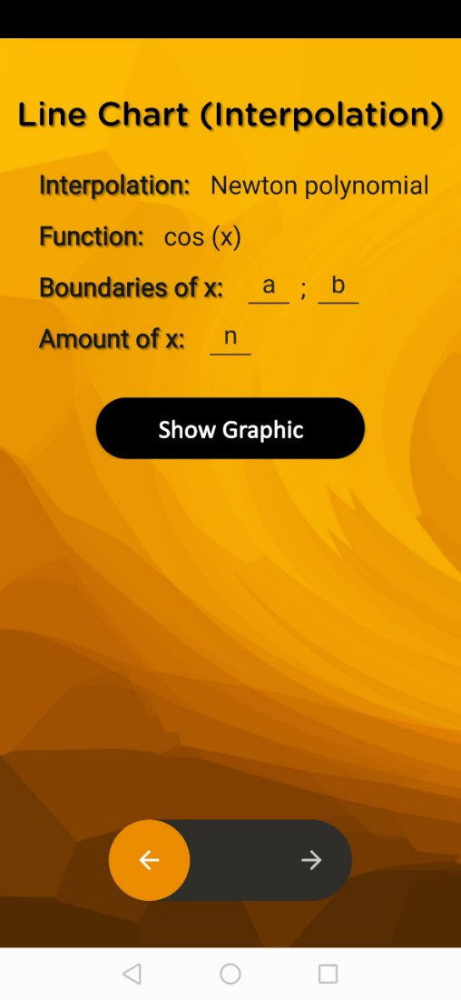
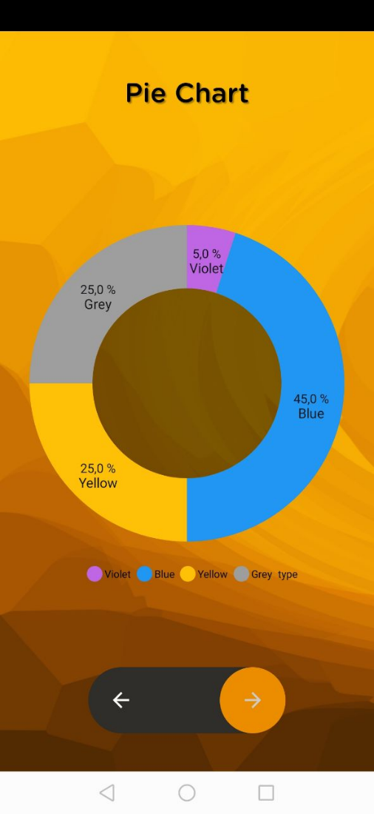
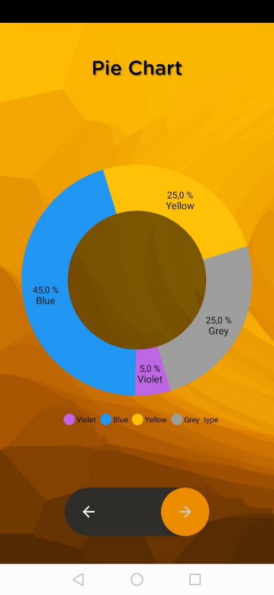
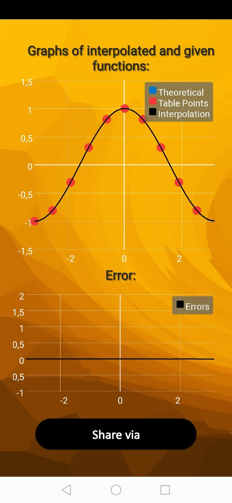
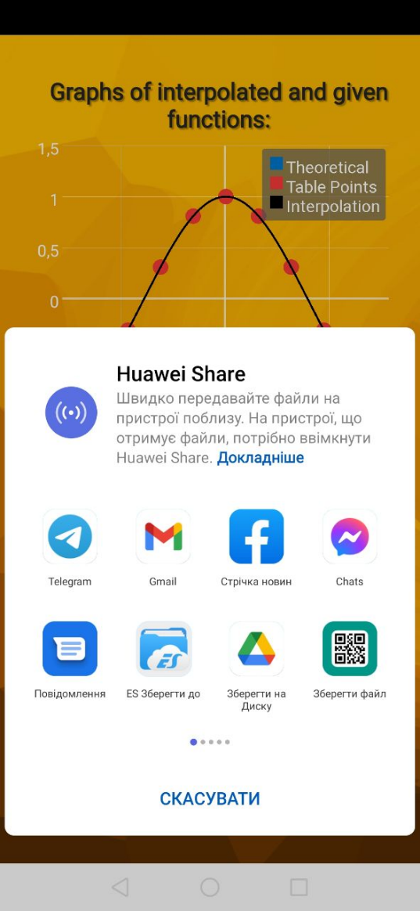
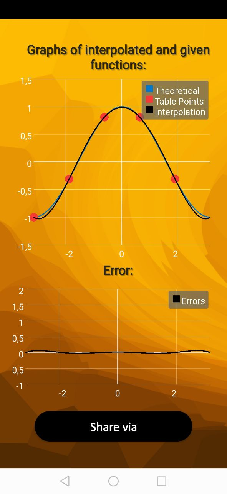
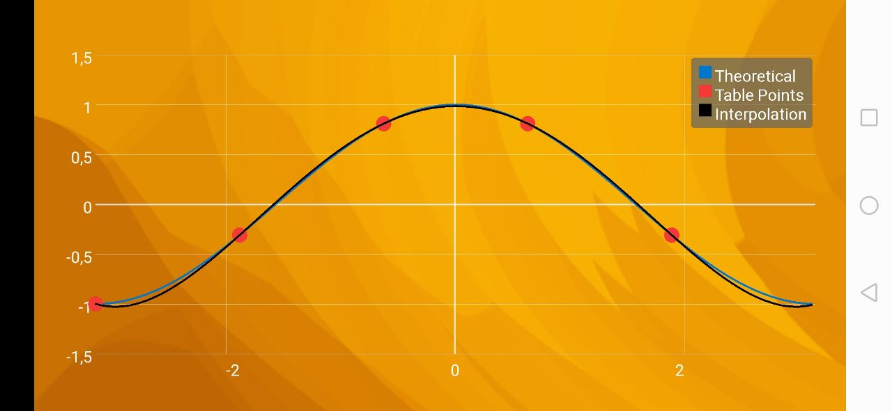
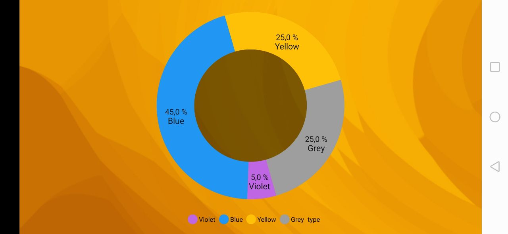
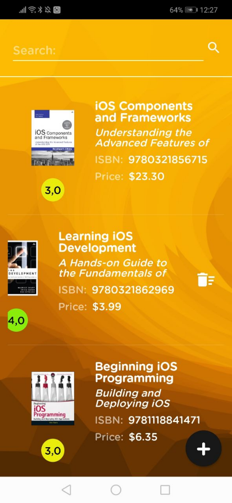
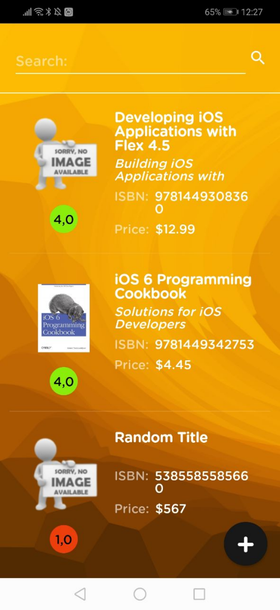

# Programming of Mobile Systems

<h1 align="center">Version 1.1</h1>

<h2>📙&nbsp;About</h2>

In this version, we considered the construction of the simplest program for Android with the output of the text about the author. We've also added custom styles to enhance the look, which includes 2 themes: light and dark, which change the slide of the screen left or right.

Custom icons of all sizes have also been created for the application. The app also contains a button that leads to my own portfolio for possible review.

<h2>📷&nbsp;Screenshots</h2>

<p align="center">
   &nbsp;&nbsp;&nbsp;
  &nbsp;&nbsp;&nbsp;
  
</p>

<h1 align="center">Version 1.2</h1>

<h2>📝&nbsp;Part 1</h2>

The first part of the work is to perform certain tasks with a list of students. Code for the task is [here](1_2_additional_assignment/Contents_Shendrikov.py).

<details>
  <summary>Tasks and Solutions</summary><p align="left">
  
<details>
  <summary>Example of a student list</summary><p align="left">

```python
students_str = "Дмитренко Олександр - ІП-84; Матвійчук Андрій - ІВ-83; Лесик Сергій - ІО-82; Ткаченко Ярослав - ІВ-83; " \
              "Аверкова Анастасія - ІО-83; Соловйов Даніїл - ІО-83; Рахуба Вероніка - ІО-81; Кочерук Давид - ІВ-83; " \
              "Лихацька Юлія - ІВ-82; Головенець Руслан - ІВ-83; Ющенко Андрій - ІО-82; Мінченко Володимир - ІП-83; " \
              "Мартинюк Назар - ІО-82; Базова Лідія - ІВ-81; Снігурець Олег - ІВ-81; Роман Олександр - ІО-82; Дудка " \
              "Максим - ІО-81; Кулініч Віталій - ІВ-81; Жуков Михайло - ІП-83; Грабко Михайло - ІВ-81; Іванов " \
              "Володимир - ІО-81; Востриков Нікіта - ІО-82; Бондаренко Максим - ІВ-83; Скрипченко Володимир - ІВ-82; " \
              "Кобук Назар - ІО-81; Дровнін Павло - ІВ-83; Тарасенко Юлія - ІО-82; Дрозд Світлана - ІВ-81; Фещенко " \
              "Кирил - ІО-82; Крамар Віктор - ІО-83; Іванов Дмитро - ІВ-82"
```
</details>

<p align="center"><b>Task 1</b></p>

Fill in the dictionary where:
- `key` - group name;
- `value` - sorted array of students belonging to the appropriate group.

<details>
  <summary>Solution</summary><p align="left">

```python
students_groups = {}

for student in students_str.split("; "):
    st_info = student.split(" - ")
    students_groups.setdefault(st_info[1], []).append(st_info[0])

for i in students_groups.values():
    i.sort()

print("\tTask1 1:\n", students_groups)
```
</details>

<p align="center"><b>Task 2</b></p>

Fill in the dictionary where:
- `key` - group name;
- `value` - dictionary, where:
	* `key` - a student who belongs to the appropriate group;
    * `value` - array with student grades (fill the array with random values using the randomValue function).

<details>
  <summary>Solution</summary><p align="left">

```python
points = [12, 12, 12, 12, 12, 12, 12, 16]


def random_value(max_value):
    r = randrange(6)
    if r == 1: return ceil(max_value * 0.7)
    elif r == 2: return ceil(max_value * 0.9)
    elif r == 3 or r == 4 or r == 5: return max_value
    else: return 0


student_points = {}

for group, students in students_groups.items():
    student_marks = {}
    for student in students:
        student_marks[student] = [random_value(points[i]) for i in range(len(points))]
    student_points[group] = student_marks

print("\n\tTask 2:\n", student_points)
```
</details>

<p align="center"><b>Task 3</b></p>

Fill in the dictionary where:
- `key` - group name;
- `value` - dictionary, where:
    * `key` - a student who belongs to the appropriate group;
    * `value` - the sum of student grades.

<details>
  <summary>Solution</summary><p align="left">

```python
sum_points = {}

for group, students in student_points.items():
    marks_sum = {}
    for student, marks in students.items():
        marks_sum[student] = sum(marks)
    sum_points[group] = marks_sum

print("\n\tTask 3:\n", sum_points)
```
</details>

<p align="center"><b>Task 4</b></p>

Fill in the dictionary where:
- `key` - group name;
- `value` - the average grade of all students in the group.

<details>
  <summary>Solution</summary><p align="left">

```python
group_avg = {}

for group, students_marks in sum_points.items():
    avg = sum(students_marks.values()) / len(students_marks.values())
    group_avg[group] = avg

print("\n\tTask 4:\n", group_avg)
```
</details>

<p align="center"><b>Task 5</b></p>

Fill in the dictionary where:
- `key` - group name;
- `value` - an array of students who have >= 60 points.

<details>
  <summary>Solution</summary><p align="left">

```python
passed_per_group = {}

for group, students_marks in sum_points.items():
    passed_per_group[group] = list(filter(lambda student: students_marks[student] > 60, students_marks.keys()))

print("\n\tTask 5:\n", passed_per_group)
```
</details>

</details>

<h2>📝&nbsp;Part 2</h2>

<details>
  <summary>Task</summary><p align="left">
  
<p align="center"><b>Task</b></p>

1. Create a class `CoordinateXY`, which represents the coordinate, where X is the first letter of your name, Y is the first letter of your last name.
2. Create a `Direction` enumeration representing the direction/position (latitude, longitude).
3. Add a `Direction` property to the `CoordinateXY` class.
4. Add an `Int` property and two `UInt` properties to the `CoordinateXY` class to represent degrees, minutes, and seconds, respectively.
5. Add initialization methods:
      * with zero default values;
      * with a set of values (degrees, minutes, seconds) (check the input values - degrees ∈ [-90, 90] for latitude ∈ [-180, 180] for longitude, minutes ∈ [0, 59], seconds ∈ [0, 59]).
6. Add methods that return:
	* values of type String in the format “xx°yy′zz″ Z”, where xx - degrees, yy - minutes, zz - seconds, Z - N/S/W/E (depends on `Direction`);
	* values of type String in the format “xx, xxx...° Z”, where xx, xxx ... - decimal value of the coordinate, Z - N/S/W/E (depends on `Direction`);
	* an object of type `CoordinateXY`, which represents the average coordinate between the coordinates represented by the current object and the object obtained as an input parameter, or nil, if the objects have a different direction/position (`Direction`).
7. Add class methods that return:
	* an object of type `CoordinateXY`, which represents the average coordinate between the coordinates represented by two objects obtained as input parameters, or nil, if the objects have a different direction/position (`Direction`).
8. Create multiple `CoordinateXY` objects using different initializers.
9. Demonstrate the use of the methods from steps 6 and 7 (output the results).
</details>

<details>
  <summary>Implementation</summary><p align="left">
  
<p align="center"><b>Implementation</b></p>

1. It was decided to expand the task a bit and make it a little more accurate, so the `CoordinateJS` (JS - Jack Shendrikov) class was designed as a small wrapper of `Latitude` and `Longitude` classes. This class contains two initialization options: with 2 parameters (latitude, longitude) or with 3 parameters (latitude, longitude, name).
2. The `Latitude` class indicates whether the place is located north or south of the equator (or at the equator if latitude 0). The `Latitude` class also contains the appropriate permissions, such as the maximum allowable latitude value when it is expressed as a floating number, the allowable latitude values are in the range of `+/-90.0`, and there are rules for allowable values of degrees, minutes, and seconds.
3. The `Longitude` class indicates whether the location is east or west of the zero meridian (or on the zero meridian if longitude is 0). Also, the `Longitude` class contains the corresponding permissions, such as the maximum allowable value of longitude, when it is expressed as a floating number, the allowable values of longitude are in the range `+/-180.0`, there are also rules for allowable values of degrees, minutes and seconds.
4. The abstract class `AbsGeoCoordinate` is the internal implementation logic for latitude and longitude, also contains the corresponding getters and setters, and a method for verifying the formatted string in degrees-minutes-seconds for the specified locale (eg `48°51'52.97"N` for US locale, or `48°51'52,97"N` for France locale).
5. The `GeoCoordException` class is used to handle possible errors.
6. And the last class is `DistanceCalculator`, which calculates the distance between the coordinates using the Haversin formula, which I chose because of the simplicity of implementation and +/- qualitative accuracy of calculations. The distance can be rotated in kilometers (default value), meters, centimeters or miles. Also in this class there is a method for calculating the average coordinate between 2 points, the method returns a new object `CoordinateJS`, which can be represented as a string and will look like `{xx°yy'zz"Z, xx°yy'zz"Z}`.
7. Appropriate unit-tests for main classes (`CoordinateJS`, `Latitude`, `Longitude` and `DistanceCalculator`) were created to check the work.
  
</details>

Main code for Part 2 is [here](https://github.com/JackShen1/android-samples/tree/main/app/src/main/java/ua/kpi/comsys/io8227/jackshen/coordinateJS).

Unit-tests for Part 2 is [here](https://github.com/JackShen1/android-samples/tree/main/app/src/test/java/ua/kpi/comsys/io8227/jackshen/coordinateJS/calculator/coordinateJS).


<h1 align="center">Version 2.0</h1>

<h2>📙&nbsp;About</h2>

In this version, it was necessary to create a second tab for the application, which displays the views in which drawing is implemented. The views show:

* graph of function drawn on points;
* drawn ring pie chart.

At one point in time, one of the two images should appear on the screen. We also needed to add a control to change what is currently displayed on the screen.

My task was to implement the function `y = cos(x)` on the interval `x ∈ [-π; π]` and a pie chart ring with sectors occupying the appropriate percentage of the circle and having the appropriate color: `45% (blue)`, `5% (purple)`, `25% (yellow)`, `25% (gray)`.

The graph output has been improved and in addition to the graph output `cos(x)` the corresponding `interpolation function` is output (used by `Newton's polynomial`).

The user can also select the number of points and boundaries on the x-axis, if the user does not select anything, the default values will be used, namely: on the x-axis `(-π, π)`, the number of points - `10`.

`ToggleButton` is implemented with animation, when switching to another position, the slider flows into the appropriate corner. `Pie Chart` is highlighted when the appropriate area is selected, and can rotate clockwise or counterclockwise.

<h2>📷&nbsp;Screenshots</h2>

<p align="center">
   &nbsp;&nbsp;&nbsp;
  &nbsp;&nbsp;&nbsp;
  
</p>
&nbsp;
<p align="center">
   &nbsp;&nbsp;
  &nbsp;&nbsp;
  &nbsp;&nbsp;
  
</p>
&nbsp;
<p align="center">
  
  
</p>


<h1 align="center">Version 3.0</h1>

<h2>📙&nbsp;About</h2>

In this version it was necessary to add the third tab and to download the corresponding archive with files, add files to the project.

Subject area - `Books`.

Next, create a class that represents the model entity of a particular subject area (`Book`). Add the appropriate fields and initializers to the class.

In this implementation, the `JSON` file with the data about the books is downloaded from the server via HTTP-request, the functionality for this, as well as for file parsing is registered in the class `BookJSONParser`.

The application also checks if the device is connected to the Internet and responds accordingly. The result of the request is checked for a failed response from the server or its absence.

The network call takes place outside the thread of the user interface using `AsyncTask`. `ListView` is populated with information from the `JSON` response. In the absence of data for display the application shows `TextView` with the corresponding message `(No books to display)`.

If the connection is successful, all the necessary data will be displayed on the screen. The code was carefully documented and the purpose of each method, class, variable was described.


<h2>📷&nbsp;Screenshots</h2>

<p align="center">
   &nbsp;&nbsp;&nbsp;
  
</p>
&nbsp;
<p align="center">
  
  
</p>


<h1 align="center">Version 4.0</h1>

<h2>📝&nbsp;Task</h2>

1. Expand the class created in the previous work that represents the model entity: add new fields to the class.
2. Add a new screen that displays complete entity information. When you click on a row of a table with a list of entities, a screen should open with complete information about the corresponding entity (complete information about the entity is read from the files).
3. Add a search box to the entity list screen. After entering the query, you must display a filtered list of entities. You can filter on any field of the entity. In the example at the end of the document, filtering occurs by entity name. If the filtered list is empty, you must display a message to that effect.
4. Add a new screen to add a new entity to the list. When creating an entity, use only the base fields that are required to display in the entity list. Remember to validate the fields: for example, the year (for a movie) and the price (for a book) can only be numeric. The created movie essence must be added to the existing list and displayed in the table.
5. Add functionality to remove an entity from the book list.
6. Make sure you can start the project and that everything works correctly.

<h2>📙&nbsp;Implemantation</h2>

1. In the previous work it was decided not to go the easy way, but to complicate the task and `JSON` file with book data was downloaded from the server via `HTTP`-request, but in this work this approach was inconvenient, so reading `JSON`-files was done from a folder. At the same time, the general architecture has not changed much, the previous implementation will remain on further versions, where it will come in handy. But you still need the Internet to upload images, because they are taken from `Imgur`.
2. A new screen has also been added to display the full entity information that opens when you click on a row in the entity list table.
3. Added search box to the screen with a list of entities. After entering the query, the result is displayed as a list of entities filtered by the title of the book. If the filtered list is empty, a message is displayed.
4. Added a new screen to add a new entity to the list. When creating an entity, fields such as `title`, `subtitle`, `price`, `isbn`, `rating` are used. Required fields are title and price. The `ISBN` may be blank, but if the user wants to enter it, he must enter 13 digits, no more, no less. Price is checked for correctness. The created essence of the book is added to the existing list and displayed in the table.
5. Added functionality to remove an entity from the list of books by swiping left.
6. Therefore, all the necessary functionality was added and tested, and the code was carefully documented and the purpose of each method, class, variable was described.

<h2>🎥&nbsp;How It Works</h2>

[](https://drive.google.com/file/d/1YsU-yvkw9KQDiIZami0rRvTBH-2Nz6CD/view)

<h2>📷&nbsp;Screenshots</h2>

<p align="center">
   &nbsp;&nbsp;
  &nbsp;&nbsp;
  &nbsp;&nbsp;
  
</p>
&nbsp;
<p align="center">
  
  
  
</p>